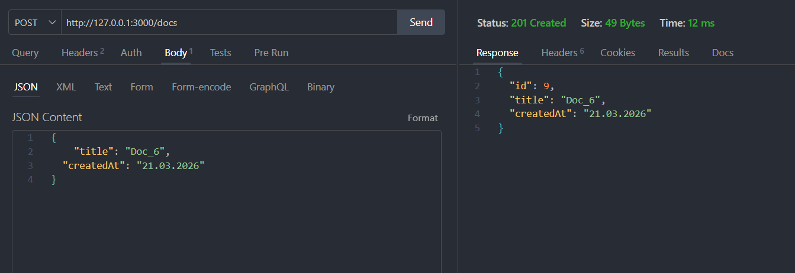
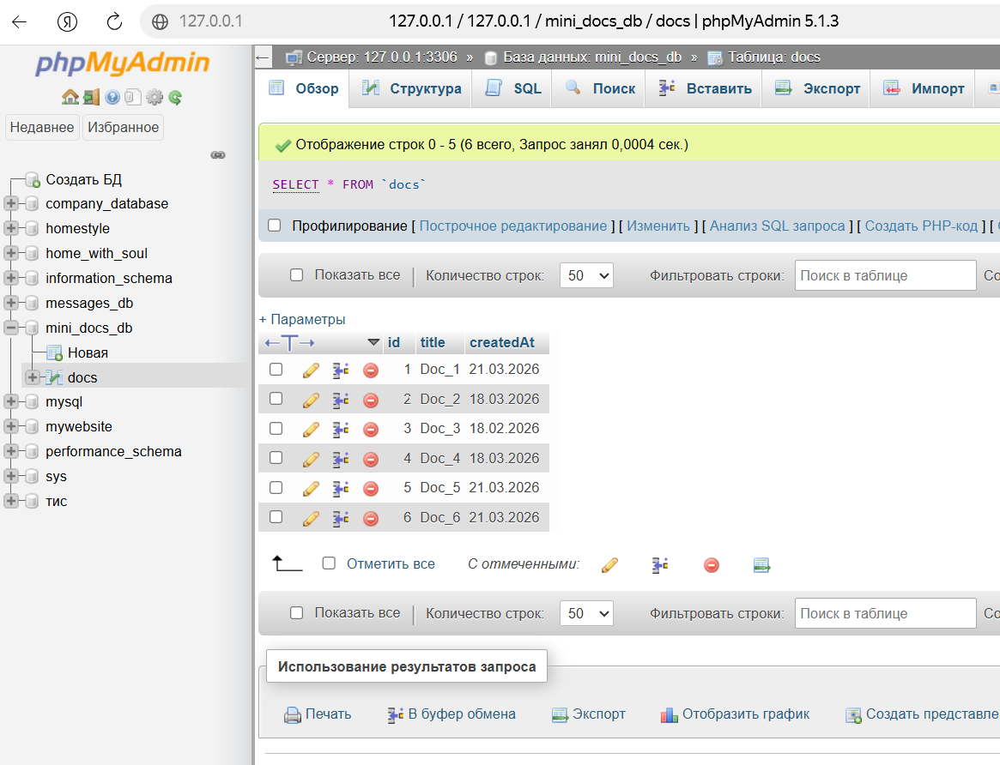
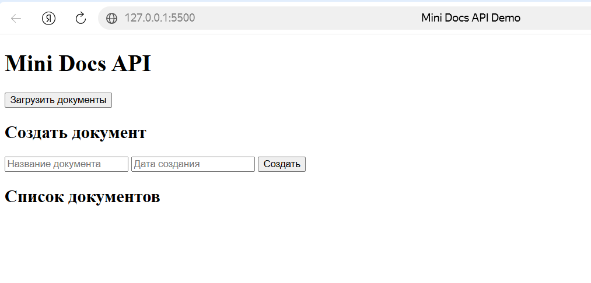

# Mini Docs API

Небольшой учебно-практический API-проект на Node.js и Express с подключением MySQL.

## Что реализовано
- получение списка документов
- получение документа по id
- создание документа
- обновление документа
- удаление документа
- базовая валидация
- обработка ошибок
- фильтрация через query params
- middleware для логирования запросов
- простая HTML-страница для работы с API через fetch

## Стек
- Node.js
- Express
- JavaScript
- MySQL

## Запуск проекта
```bash
npm install
node app.js 
```

## Основные маршруты API
- GET /docs
- GET /docs/:id
- POST /docs
- PUT /docs/:id
- DELETE /docs/:id

## Query params 
Примеры:
- GET /docs?title=Doc_1
- GET /docs?date=21.03.2026
- GET /docs?title=Doc_1&date=21.03.2026

## Главная страница
- index.html — минимальная страница для загрузки, создания, изменения и удаления документов через API

### Thunder Client


### MySQL / phpMyAdmin


### index.html
