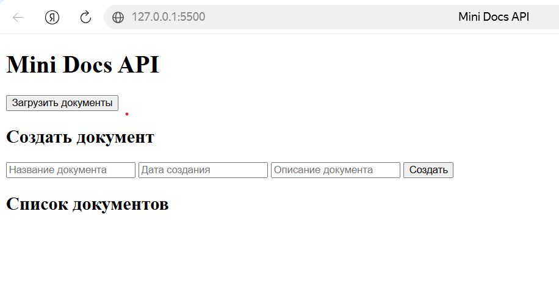
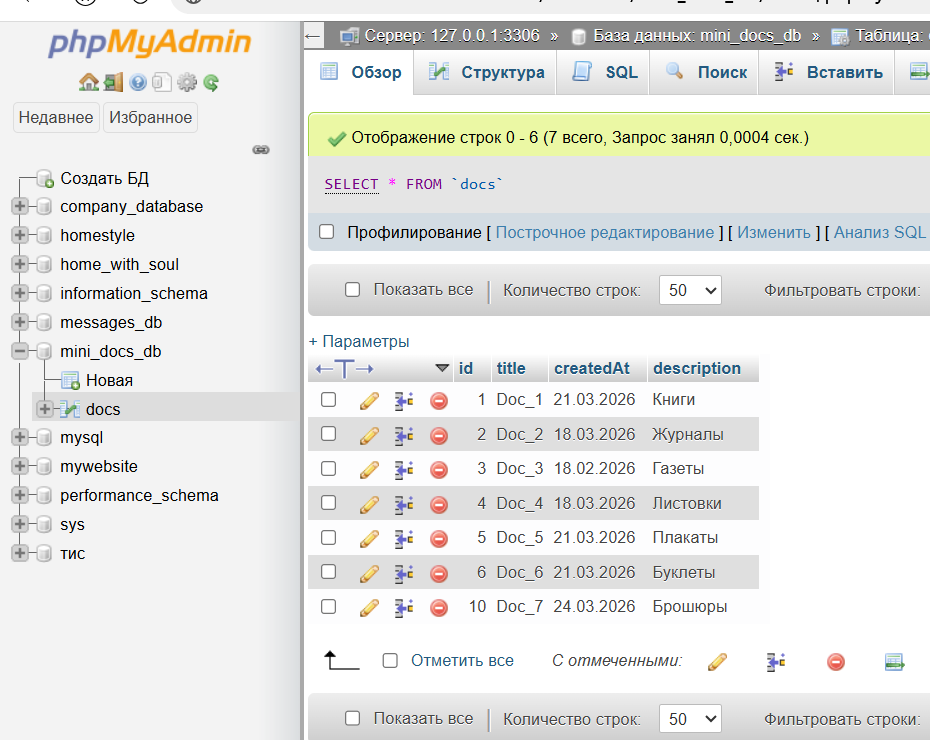
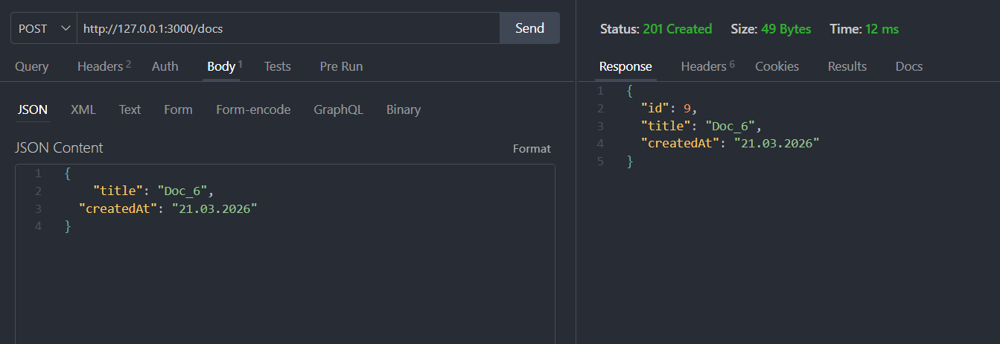

# Mini Docs API

Небольшой учебно-практический API-проект на Node.js и Express с подключением MySQL.

## Что реализовано
- получение списка документов
- получение документа по id
- создание документа
- обновление документа
- удаление документа
- базовая валидация
- обработка ошибок
- фильтрация через query params
- поиск по части названия через `LIKE`
- общий поиск по `title` и `description` через параметр `search`
- middleware для логирования запросов
- простая HTML-страница для работы с API через `fetch`

## Стек
- Node.js
- Express
- JavaScript
- MySQL
- HTML
- Fetch API

## Структура данных
Таблица `docs` содержит поля:
- `id`
- `title`
- `createdAt`
- `description`

## Запуск проекта
```bash
npm install
node app.js 
```

## Основные маршруты API
Примеры:
- `GET /docs?title=Doc`
- `GET /docs?date=21.03.2026`
- `GET /docs?description=книги`
- `GET /docs?title=Doc&date=21.03.2026`
- `GET /docs?search=doc`
- `GET /docs?search=doc&date=24.03.2026`

## Главная страница
- index.html — минимальная страница для загрузки, создания, изменения и удаления документов через API

### index.html



### MySQL / phpMyAdmin


### Thunder Client



